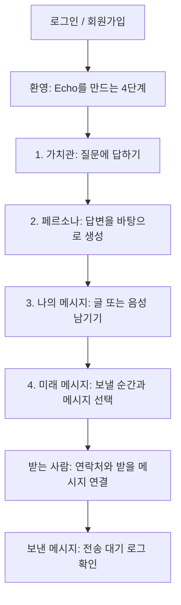
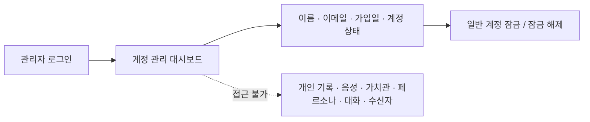

# Echo UX 플로우

## 목표

첫 로그인 사용자가 메뉴를 탐색하며 순서를 추측하지 않아도, **가치관 → 페르소나 → 나의 메시지 → 미래 메시지**의 한 줄 여정을 따라 첫 전송까지 완료하게 한다. 각 화면에는 다음 한 행동만 가장 강하게 제시한다.



## 첫 로그인 화면 구성

| 단계 | 사용자가 보는 것 | 주 행동 | 완료 기준 | 다음 안내 |
| --- | --- | --- | --- | --- |
| 로그인 | “당신의 목소리는 사라지지 않습니다”와 로그인/회원가입 | 로그인 또는 회원가입 | 인증 완료 | 네 단계 환영 화면으로 이동 |
| 가치관 | `1 / 4 가치관` 진행 표시, 한 번에 질문 하나, 짧은 이유 안내 | 답변 입력 후 다음 | 모든 필수 질문 답변 | “이 답변으로 페르소나를 만들어요” |
| 페르소나 | `2 / 4 페르소나` 진행 표시, 생성 이유와 미리보기 | 페르소나 만들기 | 페르소나 생성 | “이제 내 목소리를 남겨보세요” |
| 나의 메시지 | `3 / 4 나의 메시지` 진행 표시, 글/음성 중 하나를 선택하는 명확한 CTA | 메시지 저장 | 첫 메시지 1개 이상 | “미래의 누군가에게 보낼 수 있어요” |
| 미래 메시지 | `4 / 4 보낸 메시지` 진행 표시, 보낼 순간과 메시지 선택 | 미래 메시지 만들기 | 전송 대기 메시지 생성 | 받는 사람 연결로 안내 |
| 받는 사람 | 이름·이메일·전화번호·관계 입력, 각 사람마다 메시지 체크 | 받는 사람과 메시지 연결 | 최소 한 사람에게 메시지 배정 | “메일 발송 기능은 연결 전”이라고 고지 |
| 보낸 메시지 | 만든 미래 메시지의 상태·초대 코드·수신자 연결 여부 | 전송 대기 내역 확인 | 로그 확인 | 새 메시지 작성 또는 받는 사람 관리 |

## 화면 공통 규칙

```text
상단: Echo / 현재 단계(1~4) / 로그아웃
본문: 지금 해야 할 한 가지 + 왜 필요한지 한 문장
하단: 주요 CTA 하나 / 되돌아가기 또는 나중에 하기
```

- 상단 진행 막대는 현재 단계와 완료 단계를 숫자·텍스트로 함께 표시한다. 색만으로 완료 여부를 구분하지 않는다.
- 첫 두 단계(가치관, 페르소나)는 필수다. 로그인 직후 다른 메뉴를 눌러도 완료하지 않은 필수 단계로 되돌린다.
- 이후 단계는 순서 안내는 유지하되, 기록 추가와 미래 메시지 작성은 사용자가 필요한 시점에 다시 들어올 수 있다.
- 비어 있는 목록에서는 목록 자체보다 “첫 메시지 남기기”처럼 다음 행동을 먼저 보여준다.
- 민감한 내용이므로 설명은 짧고 단정적으로 쓴다. 한 화면에는 주 CTA를 하나만 둔다.

## 사용자 상태별 분기

| 상태 | 자동 이동 | 사용자가 해야 할 일 |
| --- | --- | --- |
| 가치관 미완료 | 가치관 | 모든 질문 답변 |
| 가치관 완료, 페르소나 없음 | 페르소나 | 페르소나 생성 |
| 필수 단계 완료, 기록 없음 | 대시보드 | 첫 메시지 남기기 |
| 기록 있음, 미래 메시지 없음 | 대시보드 | 미래 메시지 만들기 |
| 미래 메시지 있음, 수신자 미연결 | 보낸 메시지 또는 받는 사람 | 받을 사람과 메시지 연결 |
| 모든 단계 경험 | 대시보드 | 새 기록 추가·전송 대기 내역 관리 |

## 관리자 UX와 개인정보 경계

관리자는 일반 사용자 여정에 들어가지 않는다. 로그인하면 바로 **계정 관리**로 이동할 수 있다.



| 관리자가 할 수 있는 일 | 관리자가 할 수 없는 일 |
| --- | --- |
| 가입 계정의 이름, 이메일, 가입일, 활성/잠김 상태 확인 | 개인 메시지·음성 파일 열람 |
| 일반 계정 잠금·잠금 해제·관리자 지정·해제 | 가치관 답변·페르소나·AI 대화 열람 |
| 관리자 계정 여부 확인 | 미래 메시지·수신자 연락처·초대 코드 열람 |

관리 화면과 API 모두 위의 메타데이터만 반환한다. 개인 콘텐츠를 조회하는 관리자 전용 API는 만들지 않는다.

## 사망 분류 후 메일 발송

관리자는 일반 계정을 `사망으로 분류 · 메일 발송`할 수 있다. 서버는 개인 연락처를 관리자에게 보여주지 않고, 해당 사용자가 미리 연결한 수신자에게만 Gmail SMTP로 초대 링크를 발송한다. 수신자는 링크를 열어 로그인 또는 가입하면 수신함에서 메시지를 연결할 수 있다.

- Gmail 주소·앱 비밀번호는 서버 환경변수로만 설정하며 화면이나 DB에 표시하지 않는다.
- 수신자별로 여러 메시지가 있으면 링크를 한 통의 이메일에 모아 보낸다.
- 발송된 메시지는 기록해, 분류 작업을 재시도해도 같은 초대를 중복 발송하지 않는다.
