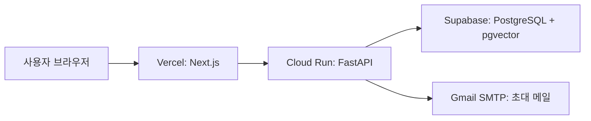

# Echo 배포 설정

해커톤 배포의 목표는 **비용·설정·운영 부담을 최소화**하는 것이다.



## 확정 구성

| 영역 | 서비스 | 역할 | 결정 이유 |
| --- | --- | --- | --- |
| 프론트엔드 | Vercel | Next.js 화면 배포 | GitHub 연결만으로 가장 간단함 |
| 백엔드 | Google Cloud Run | FastAPI, 인증, AI, 초대 메일 발송 | 요청이 있을 때만 실행되어 해커톤에 적합함 |
| DB | Supabase Database | PostgreSQL·pgvector 호스팅만 사용 | Cloud Run 안의 Docker DB는 영구 저장되지 않음 |
| 이메일 | Gmail SMTP | 사망 분류 후 수신자 초대 링크 발송 | 별도 유료 메일 서비스·도메인 없이 설정 가능 |
| 음성 파일 | 미구현 | 현재 로컬 `storage/uploads` | Cloud Run 파일 시스템은 임시이므로 실제 배포 전 Cloud Storage 연결 필요 |

> Supabase **Auth, Storage, Edge Function은 사용하지 않는다.** 현재 FastAPI JWT 로그인 구조를 유지하고, Supabase는 외부 PostgreSQL로만 쓴다.

## 1. Supabase DB 만들기

1. Supabase에서 새 프로젝트를 만든다.
2. **Database → Extensions**에서 `vector`를 활성화한다.
3. **Connect**에서 `Session pooler` 연결 문자열(포트 `5432`)을 복사한다. Cloud Run은 IPv4 환경일 수 있으므로 Direct 연결보다 Session pooler를 사용한다.
4. `postgresql://`로 시작하는 문자열의 앞부분만 아래처럼 바꿔 Cloud Run 비밀값 `DATABASE_URL`에 넣는다.

```text
postgresql+psycopg://postgres.<project-ref>:<비밀번호>@aws-<region>.pooler.supabase.com:5432/postgres?sslmode=require
```

원본 연결 문자열에 추가 옵션이 있다면 삭제하지 말고 유지한다. 비밀번호에 URL 특수문자가 있으면 Supabase가 제공한 전체 문자열을 그대로 사용한다.

5. 백엔드 첫 실행 때 `init_db()`가 Echo 테이블을 만든다. 배포 전 `vector` 확장이 켜져 있는지만 확인한다.

Supabase는 pgvector 확장을 제공하며, `vector` 확장을 활성화해 임베딩을 저장할 수 있다. 또한 서버 애플리케이션의 IPv4 연결에는 Session pooler를 권장한다. [pgvector 문서](https://supabase.com/docs/guides/database/extensions/pgvector), [연결 방식 문서](https://supabase.com/docs/guides/database/connecting-to-postgres)

## 2. Gmail 발송 전용 계정 준비

1. 발송 전용 개인 Gmail 계정을 만든다. 예: `echo.demo.mail@gmail.com`
2. 해당 Google 계정에서 **2단계 인증**을 켠다.
3. Google 계정 → 보안 → **앱 비밀번호**에서 16자리 비밀번호를 만든다.
4. 이 비밀번호는 일반 Gmail 비밀번호가 아니다. GitHub, 코드, 채팅에 올리지 않는다.

Cloud Run에서는 Gmail SMTP `smtp.gmail.com:465`을 사용한다. 25번 포트는 차단되지만 465 또는 587 포트는 사용할 수 있다. [Cloud Run SMTP 안내](https://docs.cloud.google.com/functions/docs/troubleshooting)

## 3. Cloud Run에 FastAPI 배포

### 최초 1회

PowerShell에서 실행한다.

```powershell
gcloud auth login
gcloud config set project <GCP_PROJECT_ID>
gcloud services enable run.googleapis.com cloudbuild.googleapis.com artifactregistry.googleapis.com
```

### 백엔드 소스 배포

현재 `backend` 폴더에는 `app/main.py`가 있으므로, Cloud Run Buildpack의 기본 `main:app` 대신 아래 진입점을 지정한다.

```powershell
cd backend
gcloud run deploy echo-api `
  --source . `
  --region asia-northeast3 `
  --allow-unauthenticated `
  --min-instances 0 `
  --max-instances 1 `
  --concurrency 1 `
  --set-build-env-vars 'GOOGLE_ENTRYPOINT=uvicorn app.main:app --host 0.0.0.0 --port $PORT'
```

- `min-instances 0`: 접속이 없으면 비용을 줄인다.
- `max-instances 1`, `concurrency 1`: 해커톤 중 관리자 버튼을 중복 클릭해 초대 메일이 겹칠 가능성을 낮춘다.
- Cloud Run은 소스에서 FastAPI 앱을 빌드·배포할 수 있다. [FastAPI 배포 가이드](https://docs.cloud.google.com/run/docs/quickstarts/build-and-deploy/deploy-python-fastapi-service)

배포가 끝나면 출력된 주소를 기록한다.

```text
API_URL=https://echo-api-<id>-an.a.run.app
```

## 4. Cloud Run 환경변수와 비밀값

Cloud Run 콘솔 → **echo-api → Edit and deploy new revision → Variables & Secrets**에서 설정한다.

| 이름 | 값 예시 | 종류 | 필수 |
| --- | --- | --- | --- |
| `DATABASE_URL` | Supabase Session pooler 주소 | 비밀값 | 예 |
| `OPENAI_API_KEY` | `sk-...` | 비밀값 | 예 |
| `JWT_SECRET` | 충분히 긴 랜덤 문자열 | 비밀값 | 예 |
| `SMTP_EMAIL` | 발송 전용 Gmail 주소 | 비밀값 | 메일 사용 시 |
| `SMTP_APP_PASSWORD` | Google 16자리 앱 비밀번호 | 비밀값 | 메일 사용 시 |
| `FRONTEND_APP_URL` | Vercel 실제 주소 | 일반 환경변수 | 예 |
| `CORS_ORIGINS` | Vercel 실제 주소 | 일반 환경변수 | 예 |
| `CORS_ALLOW_LAN` | `false` | 일반 환경변수 | 예 |
| `SMTP_HOST` | `smtp.gmail.com` | 일반 환경변수 | 메일 사용 시 |
| `SMTP_PORT` | `465` | 일반 환경변수 | 메일 사용 시 |
| `STORAGE_DIR` | 설정하지 않음 | - | 음성 Cloud Storage 전환 전에는 임시 |

비밀값은 일반 환경변수 대신 Secret Manager로 관리한다. Cloud Run의 환경변수 변경은 새 리비전을 만들며, `--set-env-vars`는 기존 값을 지울 수 있으므로 콘솔의 **Variables & Secrets** 화면 또는 `--update-env-vars` 사용을 권장한다. [Cloud Run 환경변수 문서](https://cloud.google.com/run/docs/configuring/services/environment-variables)

## 5. Vercel에 Next.js 배포

1. GitHub에 현재 저장소를 push한다.
2. Vercel에서 저장소를 Import한다.
3. **Root Directory**를 `frontend`로 설정한다.
4. 아래 환경변수를 넣고 Deploy한다.

| 이름 | 값 |
| --- | --- |
| `NEXT_PUBLIC_API_BASE` | Cloud Run의 `API_URL` |
| `NEXT_PUBLIC_API_PORT` | 설정하지 않음 |

5. Vercel 배포 주소가 나오면 Cloud Run의 `FRONTEND_APP_URL`, `CORS_ORIGINS`를 그 주소로 변경해 새 리비전을 배포한다.

## 6. 관리자 메일 발송 흐름

1. 생전 사용자가 **받는 사람**에서 수신자와 미래 메시지를 연결한다.
2. 관리자가 **계정 관리 → 사망으로 분류 · 메일 발송**을 누른다.
3. FastAPI가 Gmail SMTP로 수신자별 초대 링크를 보낸다.
4. 수신자가 링크를 열고 Echo에 로그인 또는 가입한다.
5. 수신함에서 초대 코드가 자동 연결되고 메시지를 열 수 있다.

관리자는 수신자의 연락처·초대 코드·개인 메시지 내용을 볼 수 없다. 서버는 발송 결과의 인원과 메시지 수만 관리자 화면에 반환한다.

## 7. 배포 전 필수 점검

- [ ] Supabase `vector` 확장을 켰다.
- [ ] `DATABASE_URL`이 Supabase **Session pooler** 주소다.
- [ ] `JWT_SECRET`, OpenAI 키, Gmail 앱 비밀번호를 Secret Manager에 넣었다.
- [ ] Vercel `NEXT_PUBLIC_API_BASE`가 Cloud Run URL과 같다.
- [ ] Cloud Run `CORS_ORIGINS`, `FRONTEND_APP_URL`이 Vercel URL과 같다.
- [ ] `CORS_ALLOW_LAN=false`로 바꿨다.
- [ ] Gmail 계정의 2단계 인증과 앱 비밀번호를 만들었다.
- [ ] 수신자 이메일로 실제 초대 메일을 한 번 테스트했다.
- [ ] 음성 파일은 현재 Cloud Run 재시작 시 사라질 수 있음을 인지했다.

## 8. 해커톤 데모 후 정리

비용이 발생하지 않도록 필요 없어진 리소스를 지운다.

```powershell
gcloud run services delete echo-api --region asia-northeast3
```

Cloud Run은 사용량 기반이지만, 빌드 이미지가 Artifact Registry에 남아 있으면 저장 비용이 발생할 수 있다. 시연이 끝나면 해당 리포지터리도 확인한다.
